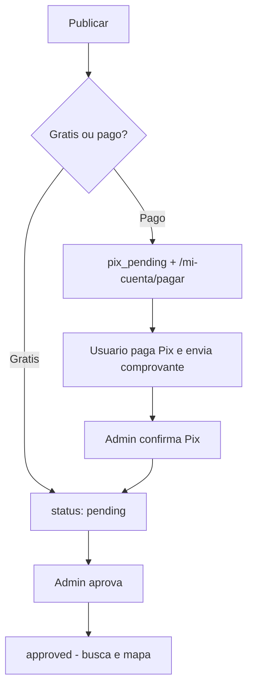

# Potilar

Portal imobiliario regional do **Rio Grande do Norte** (Brasil). Publicacao de imoveis, busca, mapa, moderacao, Pix e contas para particulares, corretores e imobiliarias.

- **Producao:** [potilar.com.br](https://potilar.com.br)
- **Stack:** Next.js 14, React, TypeScript, Tailwind, Supabase, Leaflet, Vercel

---

## Como rodar em local

```bash
npm install
cp .env.example .env.local
# Preencha as chaves Supabase em .env.local
npm run dev
```

Abra [http://localhost:3000](http://localhost:3000).

```bash
npm run build   # validar antes de deploy
npm run start   # modo producao local
```

---

## Variaveis de ambiente

| Variavel | Onde | Descricao |
|----------|------|-----------|
| `NEXT_PUBLIC_SUPABASE_URL` | Vercel + local | URL do projeto Supabase |
| `NEXT_PUBLIC_SUPABASE_ANON_KEY` | Vercel + local | Chave anon/publica |
| `SUPABASE_SERVICE_ROLE_KEY` | Vercel (servidor) | Cron de vencimento; nunca no client |
| `CRON_SECRET` | Vercel | Bearer token para `/api/cron/expire-listings` |
| `NEXT_PUBLIC_PIX_KEY` | Vercel + local | Chave Pix para recebimento |
| `NEXT_PUBLIC_PIX_WHATSAPP` | Vercel + local | WhatsApp para comprovantes (ex: `5521969724141`) |
| `NEXT_PUBLIC_ENABLE_DEMO_PROPERTIES` | Opcional | `true` so para ver imoveis demo em dev |

---

## SQL no Supabase (ordem sugerida)

Execute no **SQL Editor** do Supabase se ainda nao rodou:

1. `supabase/schema.sql` — base (se projeto novo)
2. `supabase/add_profile_account_type.sql`
3. `supabase/add_payment_lifecycle_fields.sql`
4. `supabase/update_public_listings_rpc.sql` — mapa com bairro
5. `supabase/listing_favorites.sql` — favoritos em conta
6. `supabase/green_block_migrations.sql` — m2, pet, perfis publicos, alertas, stats
7. `supabase/expire_listings_maintenance.sql` — opcional (cron na Vercel cobre o essencial)
8. `supabase/backfill_listing_expirations.sql` — se anuncios antigos sem data de vencimento

---

## Estrutura do produto

### Paginas publicas

| Rota | Funcao |
|------|--------|
| `/` | Home, buscador, destaques, mapa, noticias |
| `/imoveis` | Listagem, filtros, paginacao, alertas, mapa |
| `/imoveis/[slug]` | Ficha do imovel |
| `/imoveis/cidade/[city]` | Imoveis por cidade |
| `/anunciante/[slug]` | Perfil publico corretor/imobiliaria |
| `/anunciar` | Publicar imovel |
| `/planos`, `/imobiliarias`, `/agentes`, `/seja-parceiro` | Planos e parcerias |
| `/noticias` | Blog |

### Conta (`/mi-cuenta`)

| Rota | Funcao |
|------|--------|
| `/mi-cuenta` | Painel do anunciante |
| `/mi-cuenta/pagar/[id]` | Pagamento Pix (QR + copia e cola) |
| `/mi-cuenta/favoritos` | Favoritos sincronizados |
| `/mi-cuenta/alertas` | Buscas salvas |
| `/mi-cuenta/perfil` | Perfil publico profissional |
| `/mi-cuenta/editar/[id]` | Editar anuncio |

### Admin

| Rota | Funcao |
|------|--------|
| `/admin` | Moderar anuncios, confirmar Pix |
| `/admin/editar/[id]` | Editar qualquer anuncio |
| `/admin/news` | Noticias (CMS + rascunhos IA) |

### APIs

| Endpoint | Uso |
|----------|-----|
| `POST /api/geocode` | Geocoding ao publicar |
| `GET/POST /api/favorites` | Favoritos |
| `GET/POST/PATCH/DELETE /api/alerts` | Alertas de busca |
| `POST /api/listings/[id]/stats` | Views e cliques WhatsApp |
| `PATCH /api/profile/public` | Perfil publico |
| `GET /api/cron/expire-listings` | Pausa anuncios vencidos (cron diario) |

---

## Fluxo de negocio



**Regra:** anuncio pago nao e aprovado sem `payment_status = confirmed`.

---

## Monetizacao (`lib/plans.ts`)

| Produto | Precio |
|---------|--------|
| 1.o anuncio | Gratis |
| Anuncio adicional / temporada | R$ 19,90 |
| Renovacao temporada | R$ 9,90 |
| Destaque 7 / 30 / Super 30 dias | R$ 9,99 - R$ 49,99 |
| Plano Corretor | R$ 149,90/mes (ate 10 ativos) |
| Plano Imobiliaria | R$ 249,90/mes (ate 50 ativos) |
| Plus | R$ 399,90/mes (ate 100 ativos) |

Pix: painel em `components/PixPaymentPanel.tsx` + `lib/pix.ts` (QR e copia e cola). Confirmacao manual no admin ate integrar Asaas/Mercado Pago.

---

## Mapa e localizacao

- Coordenadas por bairro: `lib/locationCoordinates.ts`
- Geocoding: `app/api/geocode/route.ts` + cache `geocoding_cache.sql`
- Pins sobrepostos: `spreadOverlappingMarkers` em `PropertyMap.tsx`
- **Importante:** preencher **bairro** em cada anuncio para pins corretos

---

## Deploy (Vercel)

1. Push para GitHub
2. Projeto Vercel ligado ao repo
3. Configurar env vars (tabela acima)
4. `vercel.json` agenda cron diario as 9h UTC para vencimentos
5. Apos deploy, conferir build: rota `ƒ /mi-cuenta/pagar/[id]` na lista de rotas

---

## Pastas principais

```
app/           Paginas e rotas Next.js
components/    UI (mapa, filtros, Pix, formularios)
lib/           Regras de negocio (plans, pix, listings, geocode)
data/          Tipos e cidades RN
supabase/      Migracoes SQL
public/        Assets estaticos
```

---

## Pendencias conhecidas (roadmap)

- [ ] Cobro recorrente planos Pro (Asaas quando conta aprovada)
- [ ] Alertas por email/WhatsApp quando surgir imovel novo
- [ ] Paginas SEO cidade + bairro + tipo
- [ ] Paginacao no servidor (hoje carrega todos os approved em memoria)
- [ ] Redirect `/minha-conta` a partir de `/mi-cuenta`
- [ ] Remover ou atualizar `/sobre` (fotos genericas)
- [ ] Webhook Pix automatico (`/api/webhooks/mercadopago` e stub Asaas)

---

## Licenca

Projeto privado Potilar.
