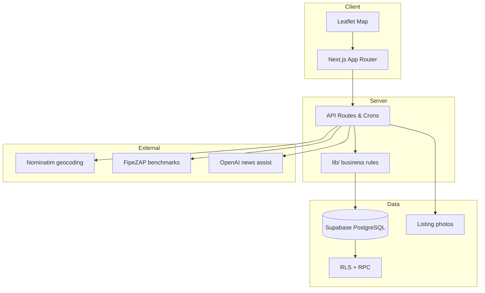

# Potilar

**Production regional real estate marketplace** for Rio Grande do Norte, Brazil.

[](https://potilar.com.br)
[](https://nextjs.org)
[](https://www.typescriptlang.org)
[](https://supabase.com)
[](https://vercel.com)

Potilar is a **full-stack product in production** - not a UI mockup. It covers the complete lifecycle of a local property portal: advertiser onboarding, listing moderation, Pix payments, map search, market intelligence, SEO content, and admin operations.

**Author:** [Ivete Amorim](https://github.com/iveteamorim) - Full-stack product engineering (solo build)

---

## Why this project matters

| Dimension | What it demonstrates |
| --- | --- |
| **Product ownership** | End-to-end marketplace: auth, listings, payments, admin, SEO, maps |
| **Backend depth** | Supabase RLS, RPCs for public access, cron jobs, geocoding cache |
| **Business logic** | Plan limits, listing expiry, Pix confirmation gates, highlight lifecycle |
| **Regional complexity** | 167+ RN cities on map, FipeZAP benchmarks, interior pricing calibration |
| **Production ops** | Vercel deploy, env separation, auditable SQL migrations |

---

## Highlights for technical review

- **Auth & roles** - individual owners, agents, agencies; profile and document flows
- **Payments** - Pix QR / copy-paste, admin confirmation before paid listing approval
- **Public access layer** - explicit RPCs + RLS fixes for anonymous listing discovery
- **Map & geo** - Leaflet, city/neighborhood resolution, Nominatim fallback, wrong-pin correction
- **Preco Justo RN** - pricing intelligence with FipeZAP sync, AVM-style scoring and approximate-market UX
- **Broker profiles** - public professional pages, brand/logo exposure and Potilar score signals
- **Automation** - cron: expire listings, sync market benchmarks monthly
- **Admin** - moderation, Pix confirmation, highlights, AI-assisted news generation

---

## Product Scope

Potilar was built as a focused marketplace for a regional market rather than a generic real estate demo. The product supports the main workflow of a local property portal:

- owners, agents and agencies can create accounts and submit listings
- admins review listings before publication
- paid listings and highlights use Pix payment references
- public users can search, filter, favorite and contact advertisers
- listings appear on a map with Rio Grande do Norte city and neighborhood context
- news and market content support SEO and user trust
- listing expiration, highlights and advertiser statistics are part of the lifecycle

---

## Core Features

### Public Marketplace

- Home page with hero search, featured listings, map section and latest news
- Listing search with filters, pagination and stable ordering
- Property detail pages with gallery, contact actions, tours, price guidance and share tools
- City-level listing pages
- Public advertiser profiles for agents and agencies
- Mobile-friendly listing and map experience

### Advertiser Area

- Authentication with Supabase
- Account types: individual owner, agent and agency
- CPF, CRECI and advertiser document flows
- Listing creation and editing
- Pix payment screen with QR/copy-and-paste reference
- "Payment sent" confirmation state for the advertiser
- Listing pause, reactivate and delete controls
- Favorites and saved search alerts
- Public profile editor for professional accounts

### Admin

- Listing moderation: approve, reject and pause
- Pix confirmation for paid listings
- Highlight activation and expiration tracking
- Listing image management
- News administration with AI-assisted article generation
- Manual review flow for payment and content safety

### Market Intelligence

- "Preco Justo RN" pricing guidance for listing creation
- FipeZAP sync endpoint for Natal benchmarks
- Calibrated regional estimates for interior cities
- Listing-level presentation signals and broker scoring
- Softer confidence messaging for approximate markets

---

## Architecture

```txt
app/           Next.js App Router pages and route handlers
components/    Reusable UI: forms, maps, cards, payment panels
lib/           Business logic: listings, pricing, Pix, Supabase, plans
data/          Static market data, cities and fallback content
supabase/      SQL migrations, policies and RPC functions
scripts/       Operational scripts, including FipeZAP sync
public/        Static assets and icons
```

The app uses Supabase for authentication, database access, RLS policies and server-side RPCs. Vercel handles deployment and scheduled jobs.

---

## Main Routes

| Route | Purpose |
| --- | --- |
| `/` | Home, search, featured listings, map and latest news |
| `/imoveis` | Public listing search |
| `/imoveis/[slug]` | Property detail |
| `/imoveis/cidade/[city]` | City listing page |
| `/anunciar` | Create a listing |
| `/anunciante/[slug]` | Public advertiser profile |
| `/noticias` | Real estate news |
| `/planos` | Pricing and plans |
| `/admin` | Moderation and payment confirmation |
| `/mi-cuenta` | Advertiser dashboard |

> Note: the account route is currently `/mi-cuenta` for compatibility with the existing product. A Portuguese alias such as `/minha-conta` is planned.

---

## Business Rules

Pricing and product limits are centralized in [`lib/plans.ts`](lib/plans.ts).

| Product | Rule |
| --- | --- |
| First individual listing | Free |
| Additional / seasonal listing | Paid Pix flow |
| Regular listing duration | 90 days |
| Seasonal listing duration | 60 days |
| Highlights | 7 days, 30 days, Super 30 days |
| Agent plan | Up to 10 active listings |
| Agency plan | Up to 50 active listings |
| Agency Plus | Up to 100 active listings |

Paid listings cannot be approved until Pix is confirmed by an admin.

---

## Local Development

```bash
npm install
cp .env.example .env.local
npm run dev
```

Open [http://localhost:3000](http://localhost:3000).

Before deployment:

```bash
npm run build
```

---

## Environment Variables

Use `.env.example` as the template. Required values include:

| Variable | Scope | Description |
| --- | --- | --- |
| `NEXT_PUBLIC_SUPABASE_URL` | client/server | Supabase project URL |
| `NEXT_PUBLIC_SUPABASE_ANON_KEY` | client/server | Supabase anon key |
| `SUPABASE_SERVICE_ROLE_KEY` | server only | Admin operations and cron jobs |
| `CRON_SECRET` | server only | Bearer token for cron endpoints |
| `OPENAI_API_KEY` | server only | AI-assisted news generation |
| `NEXT_PUBLIC_PIX_KEY` | client/server | Pix receiving key |
| `NEXT_PUBLIC_PIX_WHATSAPP` | client/server | WhatsApp for payment proof |

Secrets are not committed to the repository.

---

## Supabase Setup

SQL files live in [`supabase/`](supabase). For a fresh project, start with:

1. `supabase/schema.sql`
2. `supabase/add_profile_account_type.sql`
3. `supabase/add_payment_lifecycle_fields.sql`
4. `supabase/add_payment_proof_fields.sql`
5. `supabase/fix_public_listings_access.sql`
6. `supabase/fix_public_news_access.sql`
7. `supabase/listing_favorites.sql`
8. `supabase/green_block_migrations.sql`
9. `supabase/market_benchmarks.sql`
10. `supabase/owner_listing_controls.sql`
11. `supabase/tour_url_migration.sql`
12. `supabase/advertiser_brand_public_rpc.sql`

Some SQL files are incremental migrations created while the product evolved. They are kept explicit so production changes are auditable.

---

## Operational Jobs

### Expire Listings

`GET /api/cron/expire-listings`

Pauses expired listings and expired highlights. Protected with `CRON_SECRET`.

### Update Market Benchmarks

`GET /api/cron/update-fipezap`

Syncs FipeZAP benchmark data used by pricing intelligence. Protected with `CRON_SECRET`.

Local script:

```bash
npm run sync:fipezap
```

---

## Quality and Security Notes

- Supabase RLS is enabled for sensitive tables.
- Public listing access uses explicit RPCs for approved listings.
- Paid listing approval is blocked until Pix confirmation.
- Service role keys are server-only.
- `.env*`, `.next`, Vercel files and logs are ignored by Git.
- User-generated listings pass through moderation before public visibility.

---

## Roadmap

Short-term product evolution:

- Portuguese account alias: `/minha-conta`
- Server-side pagination for large listing volume
- City + neighborhood SEO landing pages
- Email or WhatsApp alerts for saved searches
- Automated Pix confirmation through Asaas or Mercado Pago
- Public agency pages with stronger branding
- More robust map discovery by visible area

---

## System overview



---

## Repository status

Production deployment on **Vercel** with **Supabase** backend. Actively maintained.

This repository is intentionally **product-heavy**: business flows, moderation, payment lifecycle, and regional market behavior take priority over being a small UI-only demo.

**Recruiters / hiring managers:** live demo at [potilar.com.br](https://potilar.com.br) - profile & other work at [github.com/iveteamorim](https://github.com/iveteamorim)
